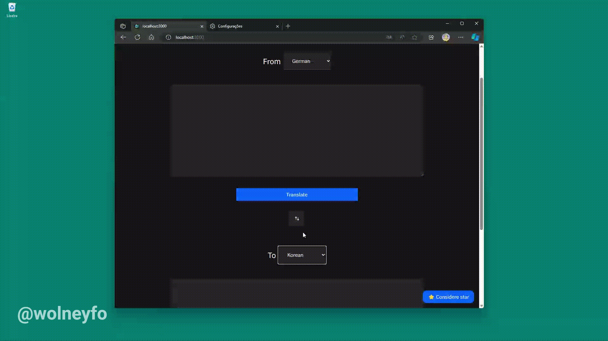

# Web Translator

A web translator app using MS Azure AI services.

## Next features
- [x] Output with speech to text
- [ ] Input with text to speech
- [ ] Language selector

## Screenshots

> 🎨 UI inspired on IBM.

## Stack
- [Next.js](https://nextjs.org/)
- Typescript
- Axios
- [Tailwindcss](https://tailwindcss.com/)
- [Azure AI Translator](https://azure.microsoft.com/en-us/products/ai-services/ai-translator/#layout-container-uidb8e1)
- [Azure Text to Speech](https://azure.microsoft.com/pt-br/products/ai-services/text-to-speech)
- [Google Fonts](https://fonts.google.com/)

## License
GNU GPLv3 by [Wolney Oliveira](https://github.com/wolney-fo)